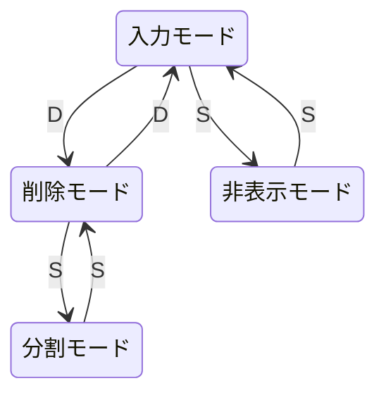

# 操作方法
* 入力モードでシフトキーを押しながらマウスカーソルを移動させると移動に合わせてラインが描画される。  
* 削除モードにすると選択可能なラインが表示されるので削除したい曲線のラインを一本削除することで曲線全体が削除される  
* 削除モードでAキーを押すことですべてのラインが削除される  
* すべてのラインが削除されると入力モードに戻ります。  
* 分割モードで、ラインを選択するとそれ以降のラインを別の曲線となる。  
* 非表示モードにすることで一時的に曲線を消すことができます。

# インジケーターのパラメーター
| パラメーター | 意味 |
| ---- | ---- |
|色|入力する線の色|
|線幅|入力する線の幅|
|削除モード切り替えキー|削除モードと入力モードを切り替えるキー|
|表示/非表示切り替えきー|入力モードと非表示モードを切り替えるキー|
|一括削除キー|削除モードで入力されているラインをすべて削除するキー|
|自動分割|ture：マウスが一度に指定値以上移動した場合は移動後の地点から新たにラインを開始する|
|自動分割距離|自動分割がtrueのときに自動分割を行う距離|
|削除モードでライン選択で即削除する|true:削除モードで削除対象のラインを選択しただけで削除を実行する|

# モード遷移

